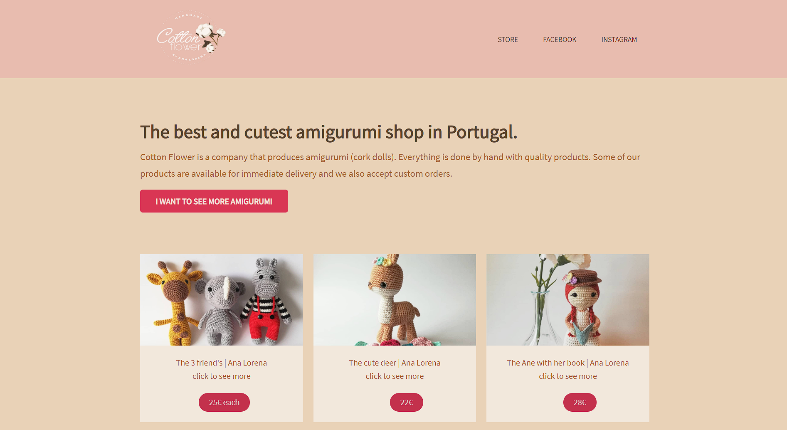
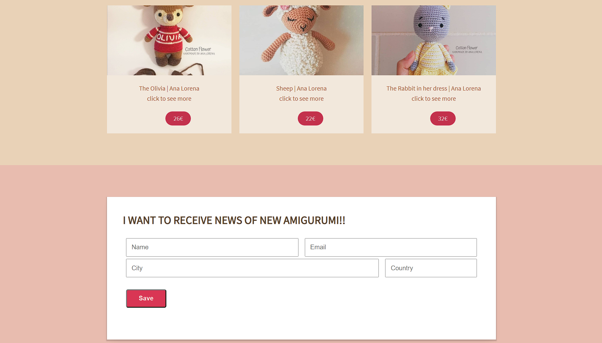

 # Response 🚀

 Here I'm using a responsive layout, this permits me have acess using a cellphone, tablet or desktop.
 For it, use of estrategies with the CSS units, how will I talk below.
 It was also used CSS Media Queries for add CSS costumization according to the defined breakpoint for the layout adapt to the device.
 I used the special HTML tags to have the most responsive layout possible.
     

 #   JavaScript 
 <a href = "#gif" >Function JS</a>

 I also used JS to add functionality to my cards. In fact, all cards are added dynamically.
 Using a const "images" that receives an array of objects with the data created. And when you click on the card the image opens using a "getAttribute" based on the "id".
 

  
    
  
    

  # CSS units:
  Layout Fixed: px (pixel) 
  Layout Fluid: % percent auto, Auto, vw (ViewPortHeight)  and vw(ViewPort Width) 
  Text Fixed: px. 
  Ex: 1px = 0.75pt or 16px = 12pt 
  Text Fluid: em (derived of "father") and  
  rem (multipled from root)
     

  # CSS Media Queries:
  In HTML I put the tag meta. 
  meta name="viewport" content="width=device-width, initial-scale=1.0"
      

  # In Css I use the media. 
  @media (max-width: 320px) {  
    #form h3 {  
      font-size: 2rem;
   } 
  }
    
  It can also be done using the atributte "meta" in link of HTML, importing a CSS file
  using the properties the same way you would use the css @media.  
   link  
    rel="stylesheet" 
    href="responsive.css"  
    media="screen and (max-width: 768px)" 
    link rel="stylesheet" href="print.css" media="print"